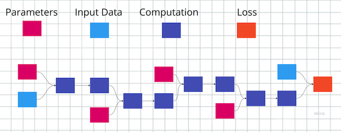
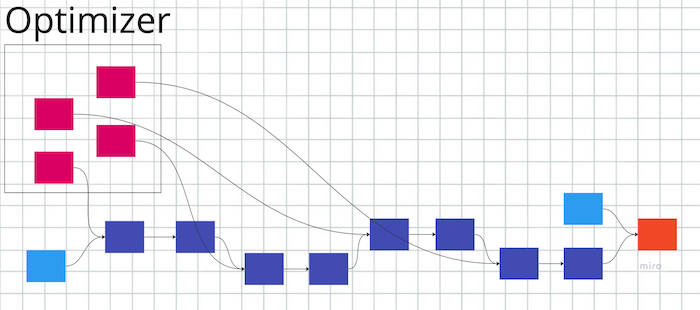
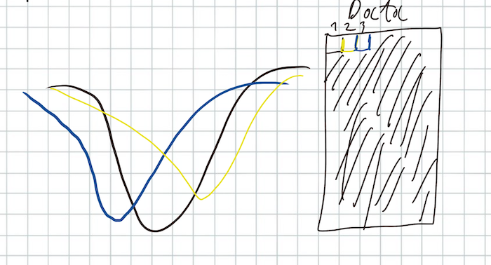
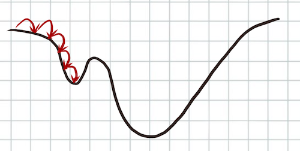
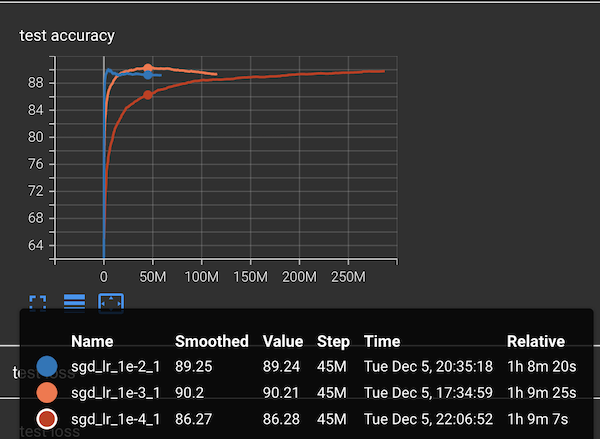
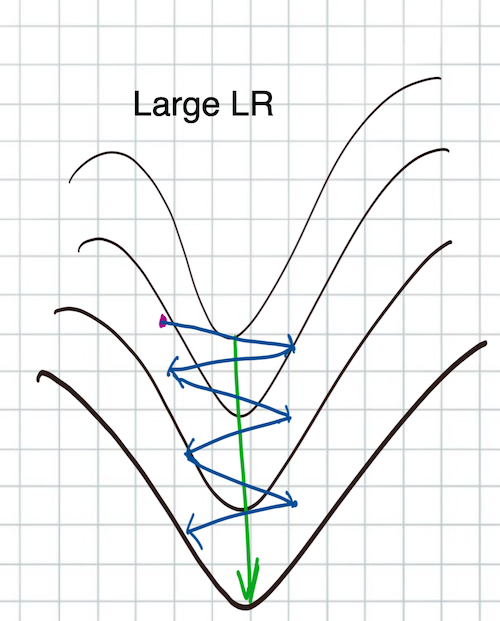
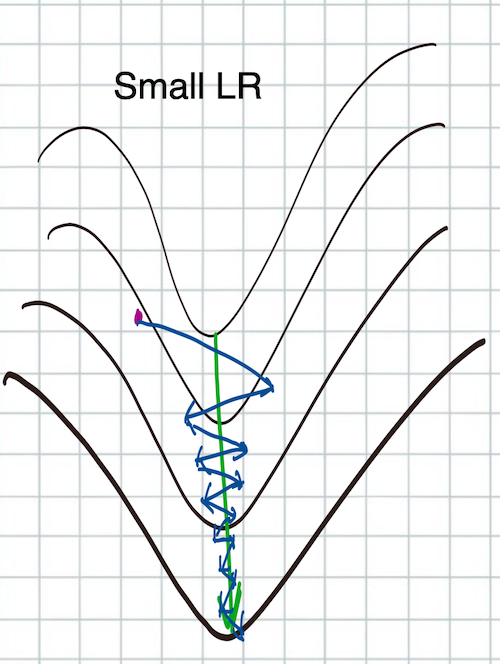

The content is also available as [video](https://youtu.be/L5mMES825Pc)  

### What is an Optimizer?
Optimizers are like "teachers" for the neural networks - they are responsible for tuning parameters of the network to make sure it outputs what we need - this condition is usually represented as minimization of some loss function.  
Recall that we can view neural networks as computational graphs:  

    

We can regroup the nodes like this:  
   
Thus underscoring that Optimizer only cares about parameters and their gradients, and nothing else. This is good from software development perspective - it makes the code modular; someone might research and implement a fancy new optimization algorithm, and everybody else can ues it in their networks without having to reimplement from scratch.  
This is how it looked like in [code](https://github.com/adensur/blog/blob/main/computer_vision_zero_to_hero/01_simple_classification/digits_mnist_classification.ipynb) from our previous post with digit classification:  
```python
optimizer = torch.optim.SGD(model.parameters(), lr=1e-3)
loss.backward()
optimizer.step()
optimizer.zero_grad()
```
We literally needed only 3 lines to define and use the optimizer. First, we create an optimizer object, passing in the model parameters - the only way of communication to the optimizer (gradients are also stored under `model.parameters()`). At each step in the optimization, we calculated the loss and called `loss.backward()` to compute the gradients; then we called `optimizer.step()` to let the optimizer know that the gradients are ready and to perform one optimization step, actually updating model parameters. Finally, we called `optimizer.zero_grad()` to prepare for the next iteration.  
### Gradient Descent
One of the classical algorithms for optimization - that is, finding a minimum of the loss function - is Gradient Descent. It can be easily visualised for 1d case - loss function depending just on one parameter (the actual plot will be in 2d because we also have value of the loss function as the extra dimension):  

We start at some point $P_0$; we compute the gradient - in 1d case, simply derivation of the loss function with respect to this parameter. The direction of the gradient (pointing left or right) shows the direction of the growth of the function; the value of the gradient corresponds to the slope of the function - 0 gradient stands for horizontal line; infinite gradient stands for vertical line.   
We then perform a "step" towards the minus gradient - minus, because we want to minimize the function - by updating the parameters like this:  
$$\theta_{i+1} = \theta_i - lr\overrightarrow\nabla$$
There, $\theta_{i+1}$ denotes the new values for the parameters, $\theta_i$ - current value for the parameter; $\overrightarrow\nabla$ - the gradient; $lr$ - learning rate (more on that later).   
The gradient will point downhill, so after several such steps we hope to get closer to the minimum.  
### Stochastic Gradient Descent
In practice, for large datasets, we can't really afford the proper "Gradient Descent". To perform one optimization step, we would need to load an entire dataset into memory, and compute predictions and gradients for all the training examples at once. This will be really hard for big datasets. [ImageNet](https://www.image-net.org/) dataset, for example, weighs around 150gb just for the images. When computing predictions, we will have to store intermediate layer predictions and parameter gradients in memory as well.   

So instead of handling an entire dataset at once, we will take only a small random batch of data - 64 images, for example; we compute predictions for this batch, get the gradients, and perform one optimization step. We then throw away this batch, get the new one, and perform the next optimization step on the next batch, and so on.   
Potential problem with this approach is that now the "loss function" is slightly different at every batch, and between the batch and the dataset as a whole:  
   
So instead of the neat step-by-step convergence towards the minimum on the entire dataset, we can get some sort of "jerky" behaviour where the updates after one batch completely cancel out updates on the previous batch. Good news is, on practice this algorithm does work, and is the main algorithm used in deep learning.   
This batch-based gradient descent is called Stochastic Gradient Descent.  
### Learning Rate
Why do we need learning rate and how it affects the training?  
If the learning rate is too big, what might happen is this:  
  
We perform a bunch of steps descending towards the minimum; but then we "overshoot", jumping over the minimum to the opposide side of this pit. On the next step, we will jump back and overshoot again; we will keep jumping around the minimum, but we'll never be able to approach it closer. In this case, learning rate defines how close we can get to the minimum - the smaller it is, the better.   
However, too small learning rate might have its own problems:  
   
First of all, the step size is now smaller, so we need more time for the training. In addition, if there are intermediate, "local" minima on the way to the global one, we will just get stuck there. This means that the optimization will never converge on the global minimum that we were interested in, and the quality of the network will be worse. With big learning rate, we could've just jumped over this local minimum.  

In practice, Learning Rate is considered a hyper-parameter that needs to be tuned by training several networks with different learning rate and comparing resulting quality. This is the example of learning curves (plots of model accuracy vs number of learning steps) from our previous [post](https://github.com/adensur/blog/blob/main/computer_vision_zero_to_hero/05_tensorboard/Readme.md)   

   

Learning rate of `1e-2`, or `0.01` (the blue line) trains the fastest, and achieves maxium accuracy of `89.99` before going into "overfitted" mode. Learning rate of `1e-3`, or `0.001` (orange one), takes much longer to train, but reaches `90.27` accuracy - meaning that the final model we could get is better, but it took longer to train. Learning rate of `1e-4`, or `0.0001` (red line), takes even more time to train, and reaches accuracy of only `89.74`. So there clearly is a trade-off there, and optimal LR is somewhere in the middle.  

### Learning Rate Scheduling
So both big and small learning rates have their advantages and disadvantages; can we invent something that would have the best of both worlds?  
One attempt of this is called "Learning Rate Scheduling". This is how it might be visualized:  
   
We start with a high learning rate initially, allowing the network to train fast and to "jump out" of potential local minima. After meeting some criteria - train loss growth is below $\epsilon$ after an epoch, for example, or simply "every once in 30 epochs", we decrease the learning rate, allowing the loss function to get closer to the desired minimum.  
2015 paper "Deep Residual Learning for Image Recognition" [link](https://arxiv.org/pdf/1512.03385.pdf) also used LR scheduling to train their ResNet model that won 2015 ImageNet competition.   
This is the visualisation of test accuracy for a similar model:  
    
As we can see, test accuracy "saturates" after training for many epochs with the same learning rate; decreasing learning rate in such cases allows network to further improve accuracy. From several such "lr decrease" steps we get this "ladder" of accuracy.   

Learning Rate scheduling also has analogues in physics and is used, for example, in Metallurgy. There is a process called "annealing" - hardening the metal by heating it up to extreme temperatures and then cooling it down. Metal structure is defined by crystal lattice:  
   
In a typical metal, the lattice will have a lot of imperfections: impurities - atoms of a different element stuck in the lattice; misplacements - missing atom or and extra atom of the same metal, causing the lattice around it to deform a little to accomodate the extra "neighbour". Such state of crystal lattice corresponds to a local minimum of energy. All physical systems tend to move towards states with smaller energy. "Local" means that this is not the ideal state of the metal, but to "jump out" of it, we need to get some extra energy first, just like we've seen with loss function. If we increase the temperature, the total energy of the metal increases; atoms start jumping around and swapping places. Such a state corresponds to higher value of energy (not what we want), but it allows the system to get out of local minima - defects and impurities move around and eventually leave the lattice; after some time, the "hardening" is done, we cool the metal down, and achieve a better state of even smaller energy than before - "global minima".  
### Momentum
Let's now try to visualize some interesting cases for 2-d version of parameters. Loss function depending on 2 parameters can be drawn as a 2d surface in 3d world.   
Now imagine if the loss function looks like a "saddle" between two mountains:  
  

Two steep ridges that meet in the middle, and a basin between them with a gentle slope (represented by green arrow). If we try to perform gradient descent with big LR, we will keep jumping back and forth between two ridges. This happens because when we are on the ridge, the slope of the ridge dominates the slope of the basin; the gradient points directly along the ridge, the component towards the bottom of the basin is really small.   
This is what might happen if the LR is smaller:   
   
The individual jumps are smaller now, so we do reach the basin eventually, and start moving towards the bottom of it. But it still takes a lot of steps.   

Momentum can help with that. It is defined as follows:  
$$momentum_{t+1} \leftarrow \mu * momentum_t + \overrightarrow \nabla $$  
Here, $\mu$ is a constant in `[0, 1)` interval.
This is basically a weighted sum of previous gradients that "decays" quite rapidly the further we go in the past. Imagine if we had previous values of the gradients from the previous 10 steps:
$$\nabla_1, \nabla_2, ..., \nabla_{10}$$  
Then the momentum on the 11th step will look like:  
$$momentum_{11} = \nabla_1 \mu^{10} + \nabla_2 \mu^{9} + ... + \nabla_{10} \mu$$  
Since $\mu$ is a constant smaller than `1`, $\mu^{10}$ will be significantly smaller than $\mu$. The number of past steps that effectively contribute to the momentum of the current step will depend on $\mu$. If $\mu=0.9$, roughly 10 last steps contribute; if $\mu = 0.999$, roughly 1000 last steps contribute.

And we use momentum instead of the gradient in the parameter update rule:  
$$\theta _{i+1} \leftarrow \theta_i - lr * momentum$$   
Closest physical analogy to momentum is *speed* in physics. Imagine an actual ball rolling downhill: initially it might get swayed a lot by encountered ridges and potholes; eventually it accumulates some speed in the direction of the prevalent gradient - downhill - and ridges and potholes affect it much less.   
This is how it might look like in our "mountain saddle" example:  
   
The first step will again "overshoot" the basin and reach on the other side; after several such jumps, the momentum along the ridge cancels out, because we jump in opposite directions each time; momentum along the basin itself keeps accumulating, so we will be moving towards the bottom of the basin much faster.  

Momentum is especially important for Stochastic Gradient Descent, because seeing only a small portion of data will sway the gradient of our loss function in different directions each time. Keeping track of momentum allows the system to remember the prevalent direction, and to converge much faster.  
### Regularization, Weight Decay
Regularization is the process of *limiting the complexity* of the network, worsening performance on the training dataset, but hopefully improving generalizability and performance on test set. Regularization aims to prevent overfitting.  

Here is a good illustration of overfitting. Imagine that we try to approximate the following function:  
$$y = \frac {1}{1 + 25x^2}$$  
With a polynome of up to 38 degree:  
$$\theta_0 + \theta_1x + \theta_2x^2 + ... + \theta_{38}x^{38}$$  
   
In addition, we choose points `x = 0.1, x = 0.2, x=0.3, ...` and so on as training examples (red dots on the picture above), and points `x = 0.05, x = 0.15, x = 0.25, ...` as test examples (white dots). We train our "model" - parameters $\theta_0, ..., \theta_{38}$ to minimize the loss function (MSE, mean squared error) on the train set.    
This could've worked somewhat well with a polynome of 2d degree, for example. With 38 degrees, something entirely different happens: we achieved almost zero error rate on all the training examples, but awful error rate on test examples.   

One of the ways to counter such "overfitting" is to penalize extremely high values of the parameters. This can be done by adding an explicit term to the loss function called "L2 norm":   
$$loss \leftarrow  loss + \frac 1 2  \lambda  \theta_i ^2$$
Taking the square of each parameters ensures that any non-zero value of the parameter will increase the loss function; in such a case, the increase in the parameter value will be justified only if it leads to even greater fall in the loss function. The parameter $\lambda$ controls the scale of this effects; bigger $\lambda$ penalize model parameters more.   
Turns out that, when we compute gradients for the loss function, the "L2 norm" part of the loss will just become an addition to the gradient:  
$$\overrightarrow \nabla \leftarrow \overrightarrow \nabla + \lambda \theta _{i}$$   
So we can achieve the same result by just modifying our optimizer a bit to use this "updated" gradient - parameters and gradients were already a part of the optimizer anyway. This is a good thing - we don't need to overcomplicate our model code with an extra loss term, we can just have a slight modification in the optimizer. This technique is called "weight decay", and this is how we can implement it in PyTorch:
```python
optimizer = torch.optim.SGD(model.parameters(), lr=1e-3, weight_decay=1e-4)
```
Easy, huh?
### Adam
Finally, let's go over another optimizer called Adam, which is considered *industry default* at the moment: if you don't know which optimizer to choose, always start with Adam!  
Adam also uses a slightly modified version of Momentum:  
$$M_{t+1} \leftarrow \mu * M_t + (1-\mu)\overrightarrow \nabla $$
In addition, it keeps track of L2 momentum:  
$$M^2_{t+1} \leftarrow \mu_2 * M^2_t + (1-\mu_2) \overrightarrow \nabla ^2$$
The update rule looks like this:  
$$\theta _{t+1} = \theta_t - \frac {lr * M}{\sqrt {M^2} + \epsilon}$$  
The nominator of the fraction looks similar to Momentum technique described below.  
The denominator has the effect of *per parameter learning rate scheduling*: it remembers the value of the gradient of the loss function with respect to this parameter in the past; if the optimization did some progress for this parameter before, the denominator increases, and the effective learning rate is reduced. $\epsilon$ is a small parameter used for numerical stability.  

    

Here is the illustration about how this can work in practice. After doing some "big steps" with high effective learning rate, L2 momentum becomes quite big, and effective learning rate goes down, allowing the optimization to approach potential minimum closer.   
Main difference to simple lr scheduling is that *effective lr* will be different for each parameter - which is usually a good thing, because different parameters might require different learning rates.  
### What's next?
Next up in the series, we will go through the final techniques in deep learning, needed to train our first big model on ImageNet dataset:
- residual connections
- batch normalization
- kaiming initialization